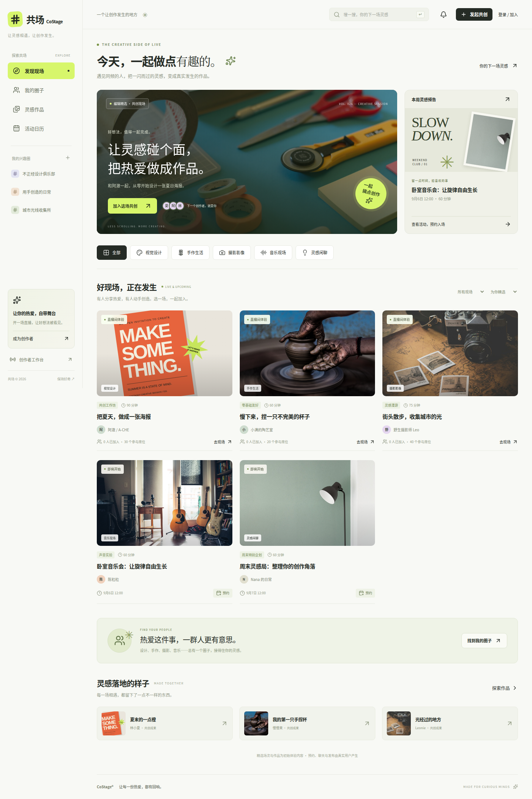

# 共场 CoStage

一个围绕「现场参与 → 一起创作 → 留下作品 → 再次相遇」构建的直播社区 MVP。

**项目位置：`/costage`，与 `/root` 同级。**

公开访问：[HTTPS 体验入口](https://lights-engage-preliminary-difficulty.trycloudflare.com) · [IP 入口](http://116.127.115.18:21282)。无需 VS Code 端口转发或服务器管理口令。HTTPS 使用临时隧道，重建隧道后地址可能变化。



## 已实现

- **发现现场**：精选专题、分类、关键词搜索、排序、活动状态筛选。
- **真实账号**：邮箱与密码注册登录、持久会话、退出登录。密码使用带独立盐的 scrypt，不保存明文。
- **预约与日历**：预约/取消、服务端席位上限、个人日历过滤、站内提醒。
- **圈子**：发现圈子、加入/退出、已加入过滤、关联活动。
- **作品**：本地图片上传、创作故事、活动关联、作品详情、点赞、个人作品与喜欢列表。
- **创作者工作台**：创建活动、设置时间/分类/席位/任务、真实预约统计。
- **实时直播**：活动所有者从浏览器摄像头与麦克风开播；服务器通过 HTTPS/HLS 向观众分发音视频；结束直播和断线清理。
- **直播互动**：Socket.IO 实时聊天、消息入库、一人一票且允许改票、任务卡、作品墙、内容反馈记录。
- **响应式界面**：桌面侧栏、手机抽屉导航、原生可聚焦对话框、加载/错误/空状态。

预置活动、主持人和作品为**演示内容**，页面明确标注，不伪造在线人数或实际收入。新注册账号、新活动、预约、聊天和作品均写入 SQLite。演示场次的画面是可切换的示例图，**不是伪装成实时直播的录像**。

## 快速启动

需要 **Node.js 24+ 和 FFmpeg（包含 libx264、AAC 编码器）**。当前机器已安装。

```bash
cd /costage
npm ci
cp .env.example .env
npm run build
npm start
```

打开 **http://localhost:3001**。生产构建由同一个 Node 服务提供网页、API 和 WebSocket，无需另外启动前端。

如果 VS Code 通过 Remote SSH 连接这台机器，在 **端口（Ports）面板中转发 3001**，然后在本地浏览器打开转发地址。转发到本机 `localhost` 可满足摄像头的安全上下文要求。不要把远程机器的 `127.0.0.1` 当成你电脑的地址。

开发模式：

```bash
npm run dev
```

前端 http://localhost:5173，后端 http://localhost:3001，Vite 自动代理 `/api` 和 `/socket.io`。对外域名需添加到 `.env` 的 `ALLOWED_ORIGINS`。

## 目录

```text
/costage/
├── apps/
│   ├── web/
│   │   ├── public/              # 本地图片、原创 SVG 海报、图标
│   │   ├── src/
│   │   │   ├── components/      # 布局、卡片、弹窗与作品表单
│   │   │   ├── pages/           # 发现 / 圈子 / 作品 / 日历 / 工作台 / 直播
│   │   │   ├── lib/             # API 客户端、全局状态、WebRTC hook
│   │   │   └── styles/          # 设计变量、基础样式、布局、页面样式
│   │   └── vite.config.ts
│   └── server/
│       ├── src/
│       │   ├── db/             # 幂等表初始化、体验种子数据
│       │   ├── routes/         # HTTP API、输入校验
│       │   └── services/       # 身份验证、数据映射、实时信令
│       └── tsconfig.build.json
├── packages/shared/src/         # 前后端共享的 TypeScript 类型
├── tests/                       # API 集成测试、浏览器端到端测试
├── docs/                        # 架构、API、设计、部署说明和实拍截图
├── deployment/                  # 容器与 Supervisor 示例
├── .github/workflows/ci.yml      # 自动测试工作流
├── .env.example
├── package.json
└── tsconfig.json
```

## 验证命令

```bash
npm run typecheck
npm run format:check
npm test
npm run build
npx playwright install --with-deps chromium
npm run test:e2e
```

API 测试使用独立临时数据库；端到端测试启动独立的 3103 端口服务，不会污染日常使用的数据。浏览器测试使用 Chromium 模拟摄像头，在禁用 WebRTC 直连的条件下验证 HTTPS/HLS 服务器分发、视频持续播放和中途加入。另已通过公网 HTTPS 与 IP 入口验证 1280×720 实时画面和声音开关。

## 第一次体验

1. 进入首页，点击「登录 / 加入」，注册自己的账号，无内置通用管理员密码。
2. 在预置直播间中体验真实聊天和投票；在日历中预约活动。
3. 点击「开直播」，选择立即开播或预约开播，填写标题、介绍和任务卡。
4. 进入自己创建的活动，点击「开启摄像头，开始直播」。
5. 用另一个浏览器或隐私窗口打开活动链接，观看现场。观众通过 HTTPS/HLS 观看，默认静音，可用音量按钮开启声音。
6. 提交一张小于 1 MB 的 JPG/PNG/WebP 图片，在作品页查看结果。

## 当前边界

这是具备真实数据和小规模直播能力的 **可运行 MVP**，还不是大规模商用平台：

- 默认采用服务器转码与 HTTPS/HLS 分发，画面有几秒延迟；目前默认最多 4 路同时开播，观众并发能力尚未做容量测试。
- 可以配置 `MEDIA_TRANSPORT=webrtc` 切回旧直连模式，但该模式跨网络仍需要 STUN/TURN。当前公网站点使用 HLS，不依赖直连。
- 未接入 CDN、OBS 推流或长期云录制。直播片段只临时保存，结束后清理。
- 活动免费，未接入支付、退款、订阅结算或电商。
- 未接入 AI，不生成实时摘要、字幕或自动剪辑。任务和作品墙已提供后续接入位置。
- 提醒是站内预约列表，不会发送邮件、短信或系统推送。
- 圈子目前提供成员关系和主题活动聚合，未实现常驻讨论区。
- 举报写入待处理记录，尚无自动审核或管理员处理面板；未实现完整运营审核体系。
- 账号尚无邮箱验证、忘记密码、MFA；注册/登录有速率限制。
- 图片以受限 data URL 存储，适合试点。规模化前应迁移对象存储、分页接口和正式数据库迁移体系。

部署与扩展细节见 [部署说明](docs/deployment.md)、[架构说明](docs/architecture.md)、[API 文档](docs/api.md)、[设计说明](docs/design.md)。

## GitHub Actions

工作流位于 `.github/workflows/ci.yml`，推送和 Pull Request 时自动运行。检查包括安装 FFmpeg、代码格式、API 测试、前后端构建和浏览器测试。失败时保存 Playwright 报告，便于定位问题。

[查看自动测试结果](https://github.com/witnessGIT/costage/actions)
