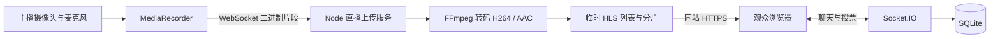

# 架构说明

## 技术选择

- 前端：React 19、TypeScript、Vite、React Router、Lucide 图标。
- 后端：Node.js 24、Express 5、Zod 校验、Socket.IO。
- 数据：Node 原生 `node:sqlite`、WAL、外键约束。
- 音视频：默认 MediaRecorder → Socket.IO 上传 → FFmpeg → HLS.js/浏览器原生 HLS，音视频通过同站 HTTPS 分发。旧 WebRTC 直连可通过配置开启。
- 验证：Node test runner + Playwright。

## 请求路径

一个服务在 3001 端口提供 API、构建后的静态页面和 WebSocket。开发环境的 5173 端口通过 Vite 代理访问后端，身份 Cookie 保持同源。

## 数据模型

| 表                    | 用途                               | 约束                               |
| --------------------- | ---------------------------------- | ---------------------------------- |
| users                 | 账号资料、scrypt 密码摘要          | 邮箱唯一                           |
| sessions              | 30 天登录会话                      | 不透明随机 token，过期检查         |
| activities            | 活动内容、所有者、时间、任务、状态 | 只有所有者可开播                   |
| reservations          | 参与席位                           | 活动+用户复合主键                  |
| circles / memberships | 圈子和成员                         | 圈子+用户复合主键                  |
| works / likes         | 作品和喜欢                         | 作品+用户复合主键                  |
| messages              | 直播间消息                         | 活动与发送者关联                   |
| votes                 | 共创投票                           | 活动+用户复合主键，choice 限定 0–2 |
| reports               | 待处理反馈                         | 记录用户、活动、原因与时间         |

预约容量检查和插入在同一进程的同步 SQLite 操作中连续执行，没有 await 交错。**不应直接扩展为多写进程**；届时需数据库事务与行锁，或原子容量更新。当前服务和 Socket.IO 房间状态都是单实例设计。

## 实时直播流程

1. 客户端首先等待 `/api/rtc-config`，默认返回 `transport: hls`。
2. 主播取得摄像头和麦克风权限，选择浏览器支持的 WebM/MP4 编码类型。
3. 服务端验证活动所有权与并发额度，启动该活动独立的 FFmpeg 编码进程。
4. MediaRecorder 每 500ms 输出一个片段，按顺序发送、等待服务端确认，限制排队大小。
5. FFmpeg 连续读取同一次录制的字节流，转成 H.264/AAC，输出约 1 秒的 HLS 分片，保留滚动窗口。
6. 观众通过同站 HTTPS 获取列表和分片，HLS.js 或浏览器原生播放器从当前直播窗口开始观看。
7. 结束直播、连接断开或上传失败时停止转码，通知观众并清理临时片段。

这一路径不依赖观众和主播直连，也不要求观众开放 UDP 端口。观众可以匿名观看，默认静音以允许自动播放。

配置 `MEDIA_TRANSPORT=webrtc` 时保留旧模式：仅交换 SDP/ICE，主播直接向每位观众传输音视频。旧模式不适用于未配置中继的跨网络部署。

直播片段不是长期录像：结束后清理文件，保留任务、消息和作品。

## 安全与限制

已实现 HttpOnly/SameSite Cookie、可配置 Secure、独立盐的密码哈希、Zod 请求验证、Helmet/CSP、HTTP 限流、聊天频率限制、同源校验、服务端资源所有权验证、信令房间隔离。公开 Bootstrap 只包含当前用户的邮箱，不会泄露其他账号邮箱/密码。

当前数据库初始化是可重复执行的 CREATE IF NOT EXISTS，适合首次部署；没有版本化迁移工具。未来结构调整应添加迁移版本表和升级脚本，禁止通过删除数据库完成上线升级。

## 后续扩展位置

- 大规模直播：将 HLS 分片迁移至 CDN/云直播，增加编码任务调度；低延迟连麦另接 SFU。当前单实例默认最多 4 路同时开播。
- AI：增加转写、摘要任务队列，结果附时间点，先由创作者审核再发布。
- 商业化：独立订单、支付回调验签、幂等、退款和分账模块。不要把预约记录当付款凭证。
- 文件：将作品 image 从 data URL 改为经校验的对象存储资源标识。
- 运营：增加角色权限、审核后台、举报状态与审计记录。

## 直播上传边界

只有活动的当前主播连接能够上传，单包不超过 1 MiB，10 秒不超过 10 MB，上传积压超过约 4 MB 时中止。编码器只允许预定义 WebM/MP4 输入类型，通过 pipe 读取，不允许客户端指定输入 URL 或本地路径。媒体请求只允许活动对应的固定列表名与分片名，临时目录随机生成。
